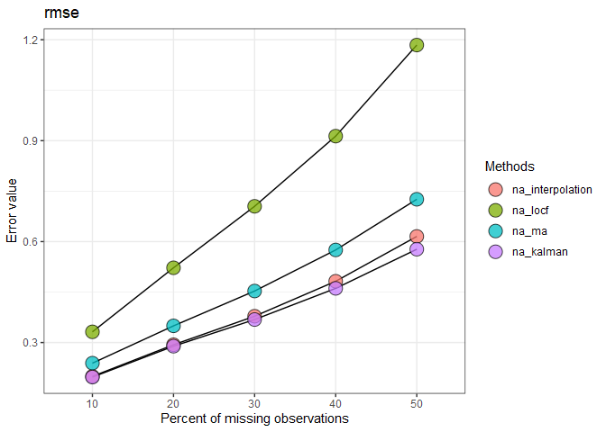

Google Summer of Code 2021
================
Mayur Shende

## Organisation: The R Project for Statistical Computing

### Project: Automated (AutoML) tool to clean univariate time series at microscales

#### Tests

-   Easy: Download the `imputeTestbench` package and demonstrate it with
    a naturally occurring time series. Document it with RMarkdown.

-   Medium: Suggest possible updates or a new feature you would like to
    include in the next version of the `imputeTestench` package.

-   Hard: Develop a dummy code of 5 functions and a vignette and pass it
    with no Error/Warning/Note through
    <https://win-builder.r-project.org/>

#### Easy Test

Install the `imputeTestbench` package using
`install.packages("imputeTestbench")` and load it.

``` r
library(imputeTestbench)
```

    ## Warning: package 'imputeTestbench' was built under R version 4.0.4

    ## Registered S3 method overwritten by 'quantmod':
    ##   method            from
    ##   as.zoo.data.frame zoo

``` r
library(imputeTS)
```

Load temperature dataset. The dataset contains \~5 years of **high
temporal resolution** (hourly measurements) temperature data from
Vancouver, Canada.
(<https://www.kaggle.com/selfishgene/historical-hourly-weather-data?select=wind_speed.csv>)

``` r
library(readr)
temperature <- read_csv("temperature.csv")
```

    ## 
    ## -- Column specification --------------------------------------------------------
    ## cols(
    ##   datetime = col_character(),
    ##   Vancouver = col_double()
    ## )

``` r
summary(temperature)
```

    ##    datetime           Vancouver    
    ##  Length:45252       Min.   :245.2  
    ##  Class :character   1st Qu.:279.2  
    ##  Mode  :character   Median :283.4  
    ##                     Mean   :283.9  
    ##                     3rd Qu.:288.6  
    ##                     Max.   :307.0  
    ##                     NA's   :794

Use `imputeTestbench` to compare various imputation methods

``` r
errs <- impute_errors(temperature$Vancouver, methods = c("na_interpolation", "na_locf", "na_ma", "na_kalman"), missPercentFrom = 10, missPercentTo = 50)
data.frame(errs)
```

    ##   Parameter MissingPercent na_interpolation   na_locf     na_ma na_kalman
    ## 1      rmse             10        0.1994888 0.3318171 0.2387271 0.1972355
    ## 2      rmse             20        0.2934247 0.5221524 0.3496052 0.2891276
    ## 3      rmse             30        0.3782250 0.7049150 0.4531255 0.3683607
    ## 4      rmse             40        0.4821345 0.9134725 0.5751792 0.4610488
    ## 5      rmse             50        0.6153928 1.1841495 0.7258125 0.5772984

``` r
plot_errors(errs, plotType = "line")
```

<!-- -->

#### Medium Test

`imputeTestbench` is a great package for comparing various methods of
imputation. Few updates that I would suggest are:

-   Introducing new sampling methods such as monte carlo.

-   Making the package interactive.

-   Developing a ShinyApp for the package.

#### Hard Test

For the final test, I created a R package called `Calculator`. It
contains five functions, `add()`, `substract()`, `multiply()`,
`divide()` and `modulo()` , with documentation and tests. Then, using
`devtools::check()`, I checked for any errors or warning, and uploaded
the source file to <https://win-builder.r-project.org/>. It passed
without errors/warnings/note.

The result of
<https://win-builder.r-project.org/> is included in the github repository([`00check.log`](https://github.com/Mayur1009/GSoC21/blob/main/files/00check.log)).
